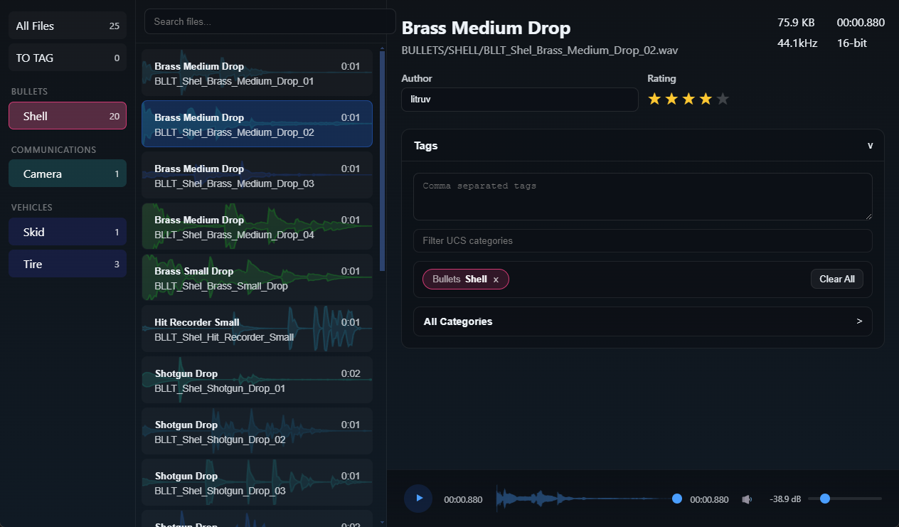
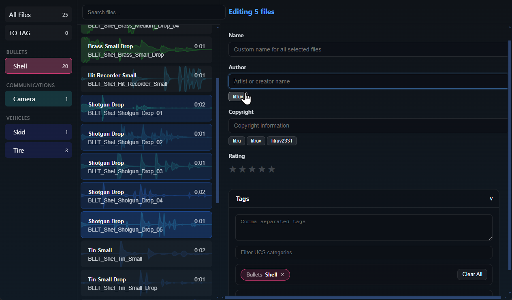
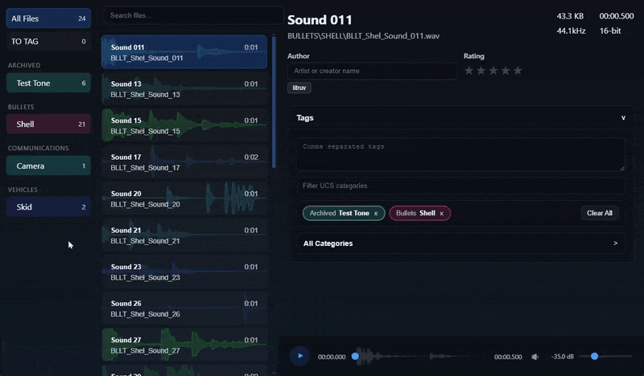

# AudioSort
[](https://github.com/litruv/AudioSort/actions/workflows/build.yml)

A desktop application for organizing, tagging, and managing WAV audio files with Universal Category System (UCS) support.



## Features

### Universal Category System (UCS)
- Pre-loaded UCS category catalog for audio categorization
- Drag-and-drop files directly onto categories for instant organization
- Intelligent file naming with automatic numbering (e.g., `AMB_Room_01.wav`)
- Automatic folder structure based on category hierarchy

### Powerful Search & Organization
- Fuzzy search across filenames, tags, categories, and metadata
- Filter by category or view untagged files
- Multi-select support for batch operations
- Custom naming with automatic conflict resolution

### Comprehensive Tagging System
- Free-form text tags
- UCS category assignments
- Metadata fields: Author, Copyright, Rating
- Bulk editing for multiple files simultaneously



### Beautiful Interface
- Real-time waveform visualization with dynamic color-coding based on RMS levels
- Smooth animations and polished drag-and-drop interactions
- Responsive file list with keyboard navigation (Arrow keys, Ctrl+A)
- Dark theme optimized for long sessions



### Smart Library Management
- Automatic library scanning and indexing
- MD5 checksums for duplicate detection
- Metadata caching for instant access
- SQLite database for fast queries and reliable storage

## Technology Stack

- **Frontend**: React 18, TypeScript, Vite
- **Backend**: Electron 29, Node.js
- **Database**: better-sqlite3 with WAL mode
- **Audio Processing**: WaveFile, music-metadata
- **Search**: Fuse.js for fuzzy search

## Installation

### From Release
Download the latest `AudioSort Setup.exe` from the [Releases](../../releases) page and run the installer.

### From Source

#### Prerequisites
- Node.js 20+ 
- npm or pnpm

#### Setup
```bash
# Clone the repository
git clone https://github.com/litruv/AudioSort/
cd AudioSort

# Install dependencies
npm install

# Run in development mode
npm run dev

# Build for production
npm run build

# Create Windows installer
npm run dist:win
```

## Usage

### Getting Started
1. Launch AudioSort
2. Set your library path via **File > Settings** (or Ctrl+,)
3. AudioSort will automatically scan and index your WAV files

### Organizing Files
1. Select one or multiple files
2. Assign categories using the Tag Editor
3. Click "Organize" to automatically move and rename files based on their categories
4. Files are organized into `CATEGORY/SUBCATEGORY/` folders with smart naming

### Keyboard Shortcuts
- `↑/↓` - Navigate file list
- `Ctrl+A` - Select all visible files
- `Ctrl+,` - Open settings
- `Double-click` - Play audio file

### Multi-Select Operations
- `Ctrl+Click` - Toggle individual file selection
- `Shift+Click` - Select range
- Edit tags, categories, and metadata for all selected files at once

## Project Structure

```
AudioSort/
├── src/
│   ├── main/              # Electron main process
│   │   ├── services/      # Core services (Database, Library, Search, Tags)
│   │   ├── MainApp.ts     # Application coordinator
│   │   └── index.ts       # Entry point
│   ├── renderer/          # React frontend
│   │   └── src/
│   │       ├── components/  # UI components
│   │       ├── stores/      # State management
│   │       └── hooks/       # Custom React hooks
│   ├── preload/           # Electron preload scripts
│   └── shared/            # Shared types and IPC definitions
├── data/                  # User data directory (created at runtime)
├── UCS.csv               # Universal Category System catalog
└── repoimages/           # Documentation assets
```

## Development

### Scripts
```bash
npm run dev          # Start development server with hot reload
npm run build        # Build renderer and main process
npm run lint         # Type-check with TypeScript
npm run test         # Run test suite
npm run pack         # Package without installer
npm run dist         # Create distributable
npm run dist:win     # Create Windows installer
```

### Testing
```bash
npm test              # Run all tests
npm run test:database # Database service tests
npm run test:library  # Library service tests
npm run test:search   # Search service tests
npm run test:tag      # Tag service tests
```

## Configuration

### Build Configuration
Edit `package.json` `build` section to customize:
- Application name and ID
- Icon and branding
- Installer options
- File associations

### Database Location
User data is stored in:
- **Windows**: `%APPDATA%/AudioSort/`
- **Linux**: `~/.config/AudioSort/`
